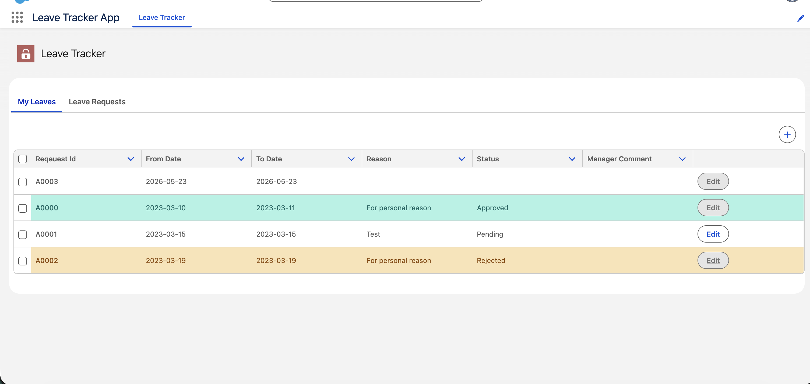

# Leave Tracker CRM — Salesforce LWC App

A Salesforce Lightning Web Components (LWC) application that lets employees submit and track leave requests, and allows managers to review and action their team's requests — all within a single Salesforce app.

## Screenshot



> **My Leaves** tab showing leave requests with colour-coded statuses: green for Approved, yellow for Rejected, and white for Pending.

---

## Features

- **My Leaves** — Employees can view all their own leave requests, see current status (Pending / Approved / Rejected), and add or edit requests.
- **Leave Requests** — Managers see only the requests raised by their direct reports, enabling quick review and action.
- **Status colour coding** — Rows are visually highlighted based on leave status for at-a-glance review.
- **Inline editing** — Edit button on each row lets users update an existing leave request without navigating away.
- **Sample data script** — An Apex class (`LeaveRequestSampleData`) is included to seed demo records into any org.

---

## Project Structure

```
force-app/main/default/
├── classes/
│   ├── LeaveRequstController.cls       # Apex controller — getMyLeaves & getLeaveRequests
│   └── LeaveRequestSampleData.cls      # Anonymous-apex seed script
├── lwc/
│   ├── leaveTracker/                   # Parent container component (tabs)
│   ├── leaveRequests/                  # Manager view — team leave requests
│   └── myLeaves/                       # Employee view — personal leave requests
├── objects/
│   └── LeaveRequest__c/                # Custom object with all leave fields
└── ...
```

---

## Custom Object: `LeaveRequest__c`

| Field | Type | Description |
|---|---|---|
| `Name` | Auto Number | Request ID (e.g. A0001) |
| `From_Date__c` | Date | Leave start date |
| `To_Date__c` | Date | Leave end date |
| `Reason__c` | Text | Reason for leave |
| `Status__c` | Picklist | Pending / Approved / Rejected |
| `Manager_Comment__c` | Text | Manager's note on the request |
| `User__c` | Lookup (User) | Employee who raised the request |

---

## Apex Controller

`LeaveRequstController` exposes two `@AuraEnabled` methods:

- **`getMyLeaves()`** — Returns all leave requests for the currently logged-in user, ordered by creation date (newest first).
- **`getLeaveRequests()`** — Returns all leave requests for users whose manager is the currently logged-in user, enabling the manager view.

---

## Deployment

### Prerequisites

- [Salesforce CLI](https://developer.salesforce.com/tools/salesforcecli) installed
- A Salesforce org (Developer Edition, Sandbox, or Scratch Org)

### Steps

```bash
# 1. Authenticate to your org
sf org login web --alias myOrg

# 2. Deploy the metadata
sf project deploy start --target-org myOrg

# 3. (Optional) Load sample data
sf apex run --file scripts/apex/LeaveRequestSampleData.apex --target-org myOrg

# 4. Open the app
sf org open --target-org myOrg
```

After deployment, navigate to the **Leave Tracker App** from the App Launcher.

---

## Tech Stack

| Layer | Technology |
|---|---|
| UI | Lightning Web Components (LWC) |
| Backend | Apex (with sharing) |
| Data | Salesforce Custom Objects |
| Platform | Salesforce (API v59+) |

---

## License

This project is provided as-is for learning and demonstration purposes.
